# Polito's Racing · IRO Ecuador 2026 – RoboRacer

**First place** at IRO Ecuador 2026 (RoboRacer), with the Polito's Racing team from the
**AIROS Club – Artificial Intelligence and Robotics Society, ESPOL**.

**Contents:** [Summary](#summary) · [Results](#results) · [Platform](#platform) · [Methodology](#methodology) · [From simulator to car](#from-simulator-to-car) · [From map to trajectory](#from-map-to-trajectory) · [Figures](#what-does-each-figure-show) · [Challenges](#challenges) · [Lessons learned](#lessons-learned) · [Project timeline](#project-timeline) · [Glossary](#short-glossary) · [Getting started](#if-you-are-just-starting) · [Credits](#credits)

---

## Summary

This project documents the development of a 1:10 scale autonomous car that competed in two
categories: **Time Trial** and **Head to Head Race**. We built the full autonomous driving
pipeline, validating each stage first in simulation and then on the real car.

---

## Results

| Category | Result |
|---|---|
| Time Trial | 10 laps without any collision in each of the 3 attempts |
| Fastest lap | 10.23 s (timed by the team) |
| Head to Head Race | Overtakes only when a safe window exists |
| Overall | **First place** |
| Straight-line speed | Up to ~4.4 m/s with a 10 Hz LiDAR |

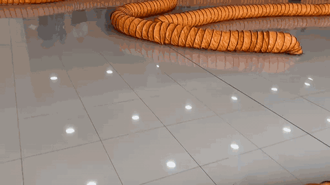

**Videos:** [10 laps (Time Trial)](media/videos/10_laps_time_trial.mp4) · [Speed test at 4.5 m/s](media/videos/speed_test_4_5_ms.mp4) · [RViz playback (test session)](media/videos/rviz_playback.mp4)

---

## Platform

| Component | Detail |
|---|---|
| Car | [F1TENTH](https://f1tenth.org) / [RoboRacer](https://roboracer.ai) platform, 1:10 scale |
| Computer | Jetson Orin Nano |
| Sensor | RPLIDAR S2 LiDAR (10 Hz) |
| Motor | VESC motor controller |
| Software | ROS 2 Humble and the F1TENTH simulator |

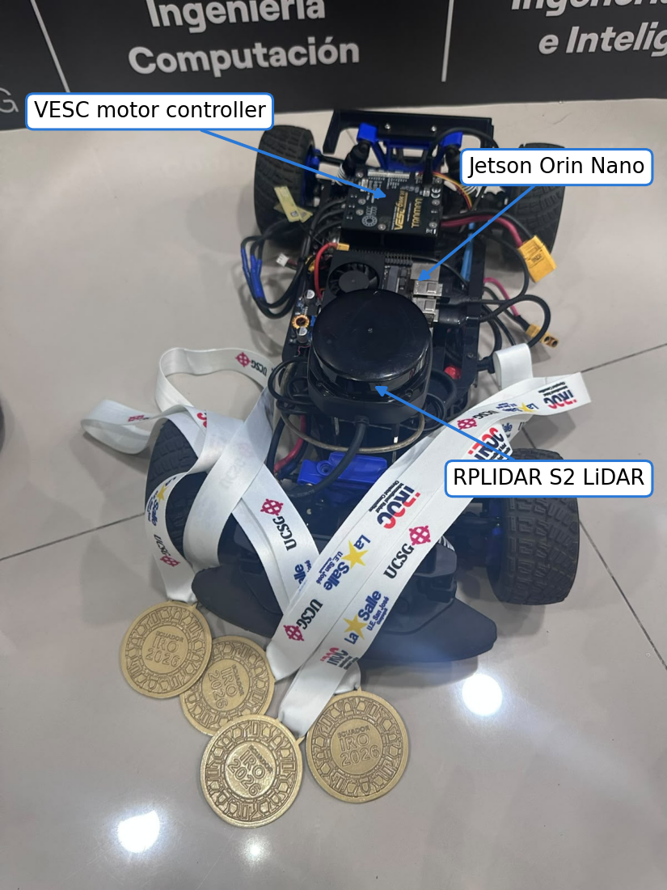

---

## Methodology

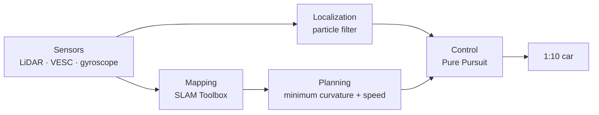

1. **Mapping:** SLAM Toolbox, followed by manual map cleanup.
2. **Planning:** minimum-curvature trajectory with a speed profile.
3. **Localization:** particle filter with gyroscope-aided odometry.
4. **Control:** Pure Pursuit.

---

## From simulator to car

Every stage was validated first in the F1TENTH simulator and then on the real car.

| Stage | In the simulator | On the real car |
|---|---|---|
| Mapping | Map of a simulated track | Map of the official track |
| Localization | Particle filter validated | Used in the competition |
| Planning | Minimum-curvature trajectory validated | Trajectory of the official track |
| Control | Pure Pursuit validated | Used in the competition |
| Head to Head | Overtakes without contact, with ideal perception | Used in the competition |

---

## From map to trajectory

**SLAM map**

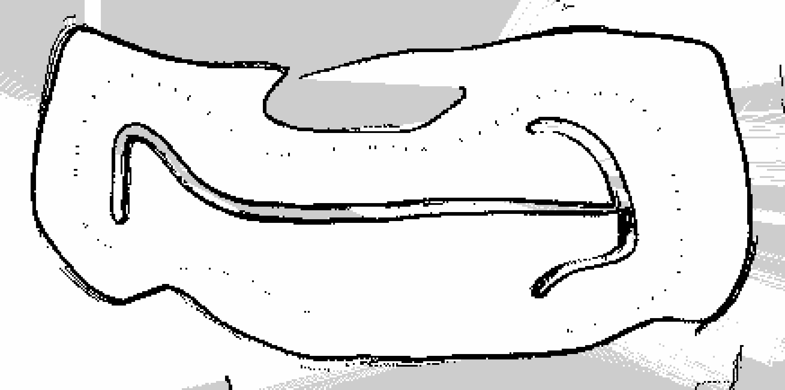

**Clean map**

**Planned trajectory**

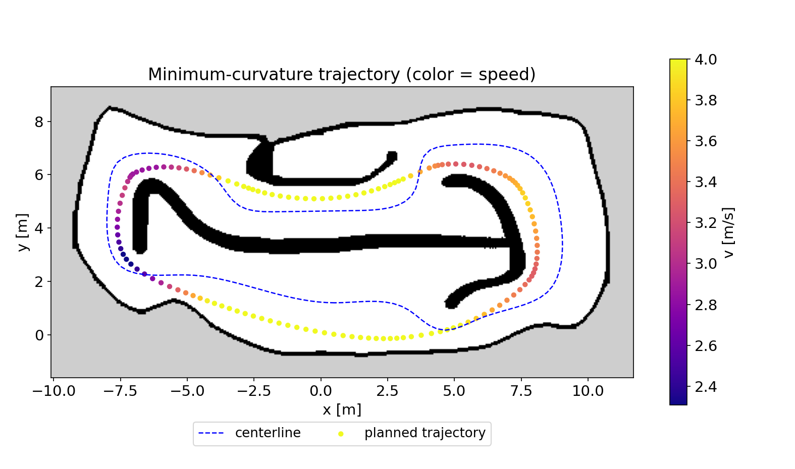

**Speed profile**

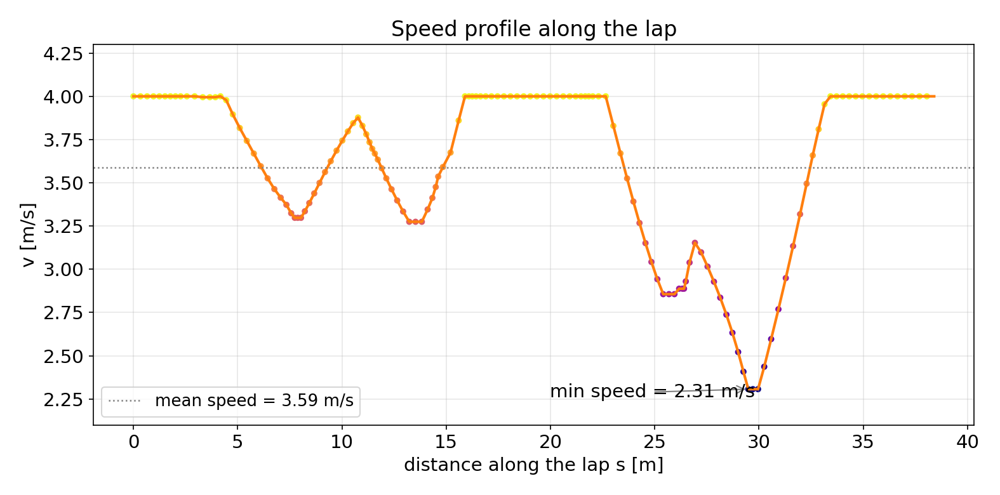

**Safety margin: m15 vs m20**

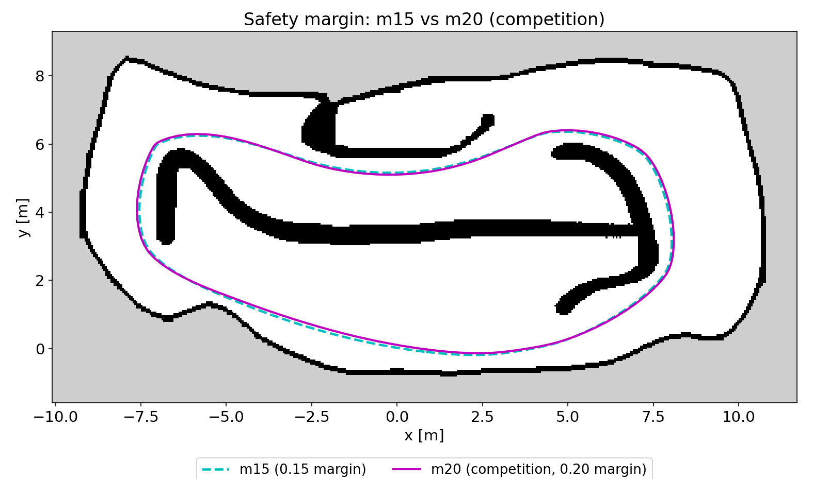

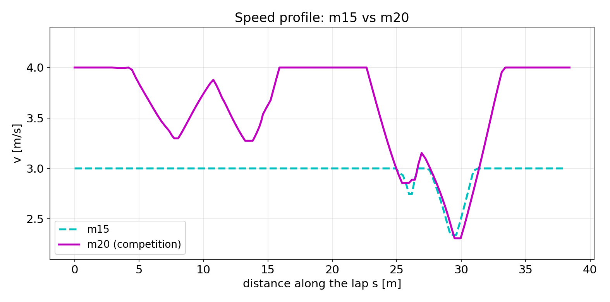

**RViz visualization**

Playback of a test session: planned trajectory (green), the car's path (orange) and its current position (blue arrow).

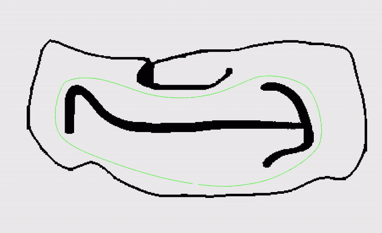

**Actual path vs planned trajectory**

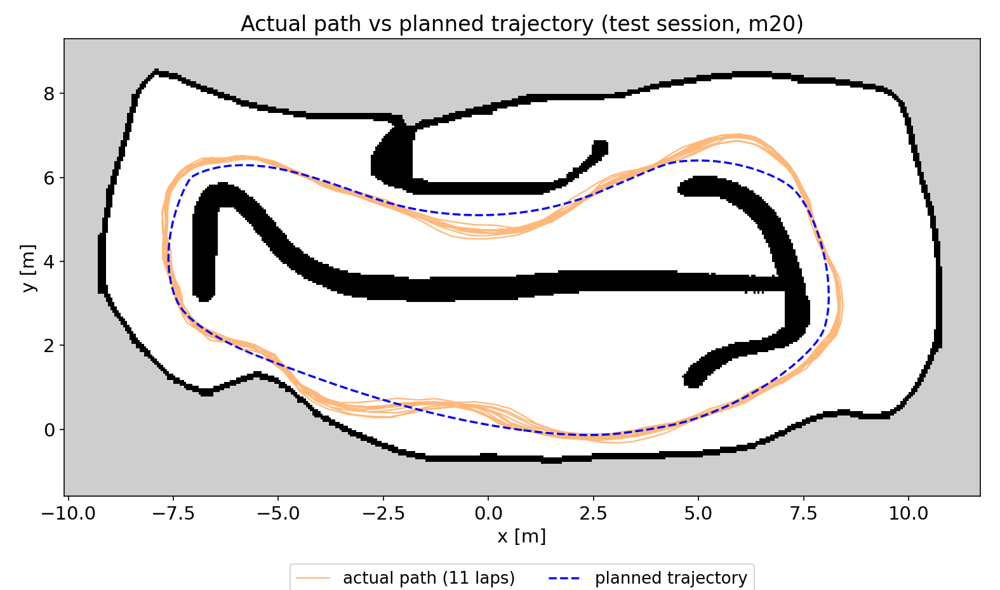

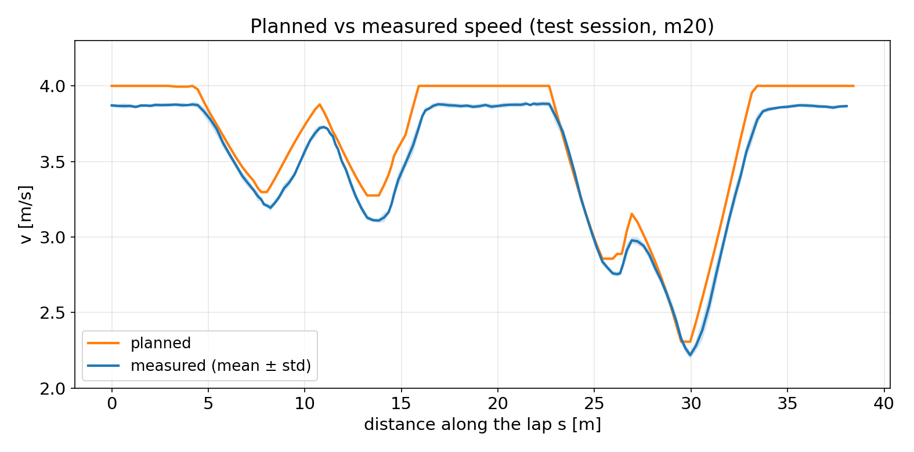

---

## What does each figure show?

| Figure | What it is | What to look for |
|---|---|---|
| SLAM map | The track map as produced by SLAM Toolbox. | Noise outside the track and walls with gaps. |
| Clean map | The same map after manual cleanup. | Only the track and the tube islands remain: this is the map used for localization and planning. |
| Planned trajectory | The minimum-curvature line over the map, colored by speed, next to the centerline. | The slowest points are in the tight corners and the fastest on the straights. |
| Speed profile | Planned speed along one lap. | Fast straights, braking before each corner, and the tightest corner as the slowest point. |
| Safety margin (map and speed) | Two trajectories with different safety distance to the wall: m15 and m20. | A larger margin leaves more room to the wall, and the profile allows more speed on the straights. m20 was used in the competition. |
| Actual path vs plan (map) | The path estimated by the particle filter over 11 test laps, over the planned trajectory. | The car follows the shape of the trajectory, with deviations of a few tens of centimeters. |
| Planned vs measured speed | Planned speed against the speed measured by the car, averaged over those laps. | The car reproduces the profile, with a slightly lower real speed. |

*The trajectory and speed figures come from the planning stage and from a test session, not from the competition laps.*

---

## Challenges

- **10 Hz LiDAR:** at ~4 m/s the car travels about 40 cm between consecutive readings, which limits the speed at which it can be localized accurately.
- **Competition floor:** being smooth, its grip limited cornering speed; in tests above ~4 m/s the car lost traction.

---

## Lessons learned

- Measure the real car instead of assuming its parameters.
- Validate each stage in the simulator before taking it to the car.
- Save the data of every test so it can be analyzed later.
- A slow LiDAR is compensated by good odometry and good localization.

---

## Project timeline

| Milestone | Outcome |
|---|---|
| F1TENTH simulator | Full pipeline validated before touching the car |
| First autonomous run on the real car | Control and localization working at low speed |
| Official track | Own map, trajectory and first laps |
| Gyroscope odometry | Better heading estimate, and more speed with safety |
| Measuring the real car | Real parameters instead of assumptions; ~12.2 s laps in tests |
| Competition (October 1, 2026) | Fastest lap of **10.23 s** |

---

## Short glossary

- **SLAM:** building a map while localizing the car.
- **Particle filter:** estimates where the car is by comparing the LiDAR with the map.
- **Minimum-curvature trajectory:** the line that avoids tight turns so the car can go faster.
- **Pure Pursuit:** controller that chases a point on the trajectory ahead of the car.
- **Odometry:** estimating motion from speed and steering.

---

## If you are just starting

A learning order, from the basics to the full pipeline:

1. **ROS 2:** nodes, topics and transforms ([documentation](https://docs.ros.org/en/humble/)).
2. **Teleoperation:** drive the car with a controller and understand the sensors.
3. **SLAM:** build a map of the track ([SLAM Toolbox](https://github.com/SteveMacenski/slam_toolbox)).
4. **Localization:** particle filter.
5. **Planning:** minimum-curvature trajectory and speed profile.
6. **Control:** Pure Pursuit.
7. **Head-to-head racing:** following and overtaking safely.

You learn step by step.

---

## Next steps

We keep preparing for international competitions.

---

## Credits

Team: Héctor La Mota, Anthony Guadalupe, Raúl Villavicencio,
Micaela Carolina Anamise Llumiquinga and Marcos Emmanuel Balón.

Coach: Winter Delgado ([@widegonz](https://github.com/widegonz)).
