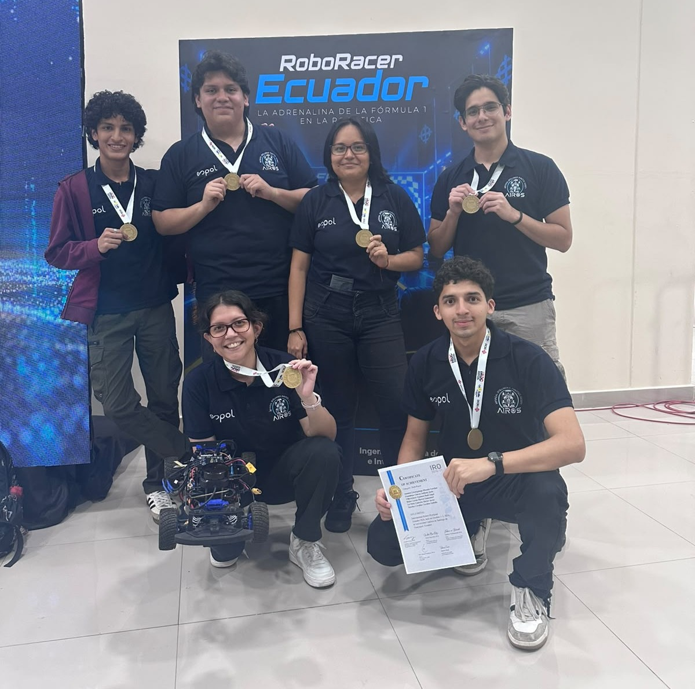
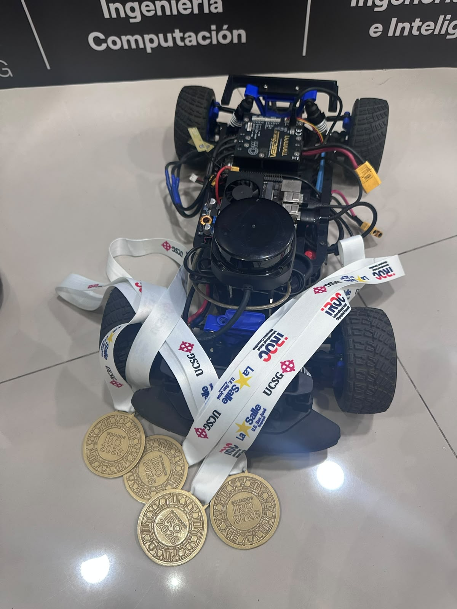
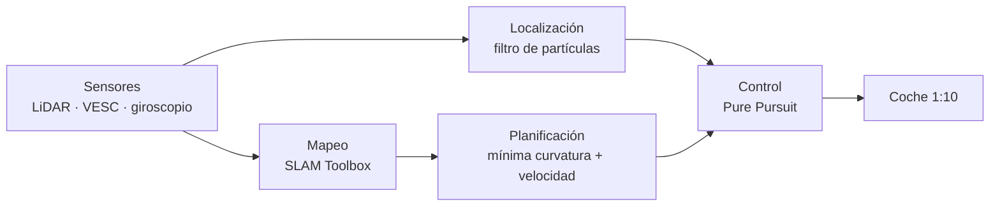
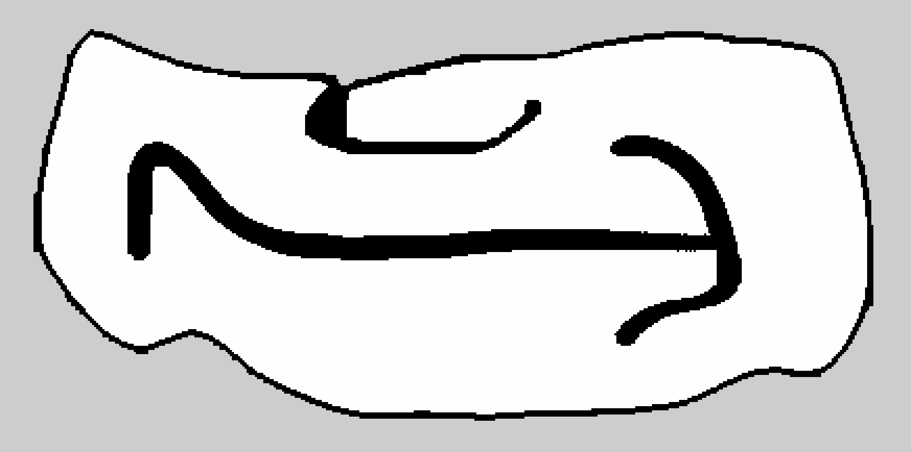
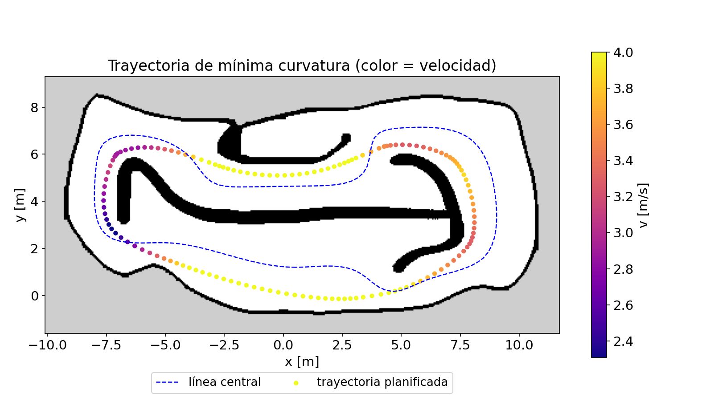
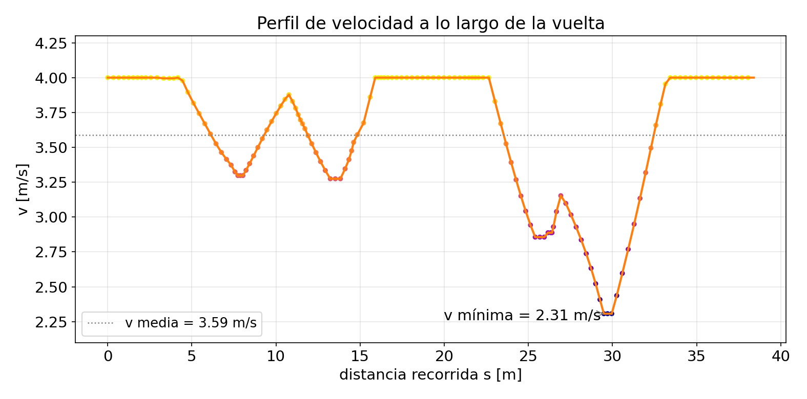
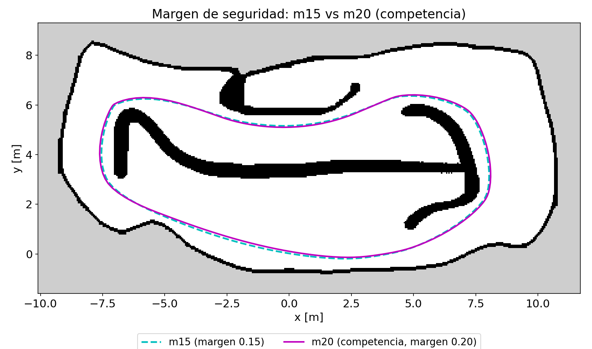
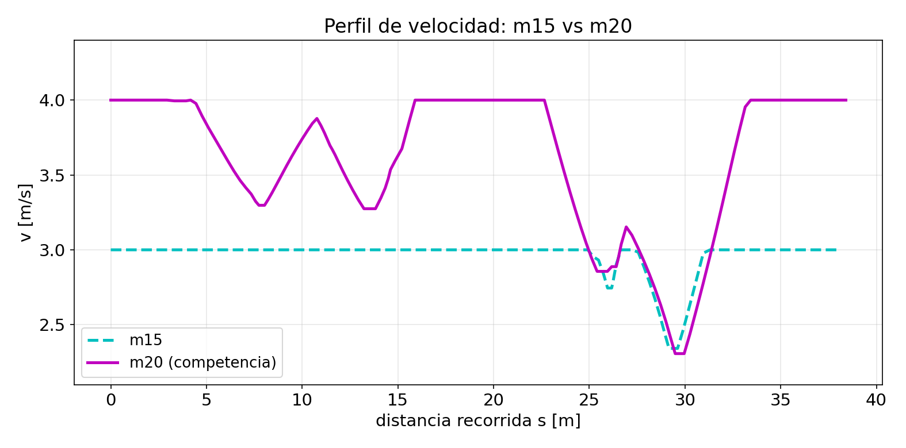
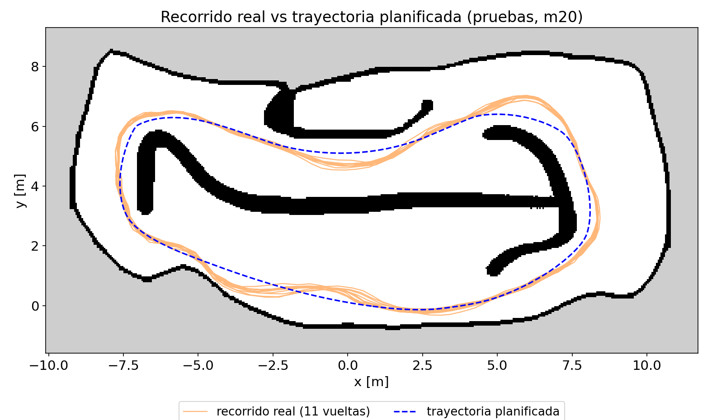
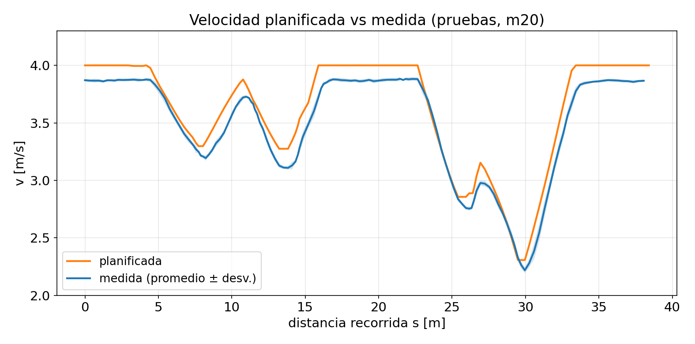

# Polito's Racing · IRO Ecuador 2026 – RoboRacer

**Primer lugar** en el IRO Ecuador 2026 (RoboRacer), con el equipo Polito's Racing del
**Club AIROS – Artificial Intelligence and Robotics Society, ESPOL**.

---

## Resumen

Este proyecto documenta el desarrollo de un coche autónomo a escala 1:10 que compitió en
dos categorías: contrarreloj (*Time Trial*) y carreras contra otro coche (*Head to Head Race*).
Se construyó la cadena completa de conducción autónoma, validando cada etapa primero en
simulador y después en el coche real.

---

## Resultados

| Categoría | Resultado |
|---|---|
| Time Trial | 10 vueltas sin ninguna colisión en cada uno de los 3 intentos |
| Vuelta más rápida | 10.23 s (tiempo del equipo) |
| Head to Head Race | Adelantamiento solo cuando existe una ventana segura |
| Clasificación general | **Primer lugar** |
| Velocidad en recta | Hasta ~4.4 m/s con un LiDAR de 10 Hz |

**Videos:** [10 vueltas (Time Trial)](media/videos/10_vueltas_time_trial.mp4) · [Prueba de velocidad](media/videos/prueba_de_velocidad.mp4)

---

## Plataforma

| Componente | Detalle |
|---|---|
| Coche | Plataforma [F1TENTH](https://f1tenth.org) / [RoboRacer](https://roboracer.ai), escala 1:10 |
| Computador | Jetson Orin Nano |
| Sensor | LiDAR RPLIDAR S2 (10 Hz) |
| Motor | Controlador VESC |
| Software | ROS 2 Humble y el simulador F1TENTH |

---

## Metodología

1. **Mapeo:** SLAM Toolbox, y limpieza manual del mapa.
2. **Planificación:** trayectoria de mínima curvatura con perfil de velocidad.
3. **Localización:** filtro de partículas con odometría apoyada en giroscopio.
4. **Control:** Pure Pursuit.

---

## Del mapa a la trayectoria

**Mapa SLAM**

**Mapa limpio**

**Trayectoria planificada**

**Perfil de velocidad**

**Margen de seguridad: m15 vs m20**

**Recorrido real vs trayectoria planificada**

---

## ¿Qué muestra cada figura?

| Figura | Qué es | Qué se observa |
|---|---|---|
| Mapa SLAM | Mapa de la pista tal como lo genera SLAM Toolbox. | Contiene ruido fuera de la pista y paredes con huecos. |
| Mapa limpio | El mismo mapa después de limpiarlo a mano. | Solo queda la pista y las islas de mangas: es el mapa que usan la localización y la planificación. |
| Trayectoria planificada | La línea de mínima curvatura sobre el mapa, coloreada por velocidad, junto a la línea central. | Los puntos más lentos están en las curvas cerradas y los más rápidos en las rectas. |
| Perfil de velocidad | La velocidad planificada a lo largo de una vuelta. | Rectas rápidas, frenada antes de cada curva y la curva más cerrada como punto más lento. |
| Margen de seguridad (mapa y perfil) | Dos trayectorias con distinta distancia de seguridad a la pared: m15 y m20. | Un margen mayor deja más holgura a la pared, y el perfil permite más velocidad en recta. La m20 fue la usada en la competencia. |
| Recorrido real vs plan (mapa) | El recorrido estimado por el filtro de partículas en 11 vueltas de pruebas, sobre la trayectoria planificada. | El coche sigue la forma de la trayectoria, con desvíos de decenas de centímetros. |
| Velocidad planificada vs medida | La velocidad prevista contra la que midió el coche, promediada en esas vueltas. | El coche reproduce el perfil, con una velocidad real ligeramente menor. |

*Las figuras de trayectoria y velocidad corresponden a la planificación y a una sesión de pruebas, no a las vueltas de la competencia.*

---

## Retos

- **Un LiDAR de 10 Hz:** a ~4 m/s el coche avanza unos 40 cm entre una lectura y la siguiente.
- **Piso liso:** el agarre limita la velocidad en curva.
- **Tiempo:** pasar de cero a una cadena completa en pocos meses.

---

## Lo que aprendimos

- Medir el coche real en lugar de suponer sus parámetros.
- Validar cada etapa en el simulador antes de llevarla al coche.
- Guardar los datos de cada prueba para analizarlos después.
- Un LiDAR lento se compensa con buena odometría y buena localización.

---

## Cronología

| Fase | Qué se hizo |
|---|---|
| 1 | Aprendizaje de ROS 2 y trabajo en el simulador F1TENTH |
| 2 | Paso al coche real: control manual, mapeo y localización |
| 3 | Planificación de trayectorias y control autónomo |
| 4 | Ajuste de velocidad y competencia (1 de octubre de 2026) |

---

## Glosario breve

- **SLAM:** construir un mapa mientras se localiza el coche.
- **Filtro de partículas:** estima dónde está el coche comparando el LiDAR con el mapa.
- **Trayectoria de mínima curvatura:** la línea que evita curvas cerradas para poder ir más rápido.
- **Pure Pursuit:** controlador que persigue un punto de la trayectoria por delante del coche.
- **Odometría:** estimación del movimiento a partir de la velocidad y el giro.

---

## Si estás empezando

Un orden para aprender, de lo más básico a lo más completo:

1. **ROS 2:** nodos, tópicos y transformadas ([documentación](https://docs.ros.org/en/humble/)).
2. **Teleoperación:** mover el coche con un control y entender los sensores.
3. **SLAM:** hacer un mapa de la pista ([SLAM Toolbox](https://github.com/SteveMacenski/slam_toolbox)).
4. **Localización:** filtro de partículas.
5. **Planificación:** trayectoria de mínima curvatura y perfil de velocidad.
6. **Control:** Pure Pursuit.
7. **Carreras head-to-head:** seguir y adelantar con seguridad.

Se aprende paso a paso.

---

## Próximos pasos

Seguimos preparándonos para competencias internacionales.

---

## Créditos

Equipo: Héctor La Mota, Anthony Guadalupe, Raúl Villavicencio,
Micaela Carolina Anamise Llumiquinga y Marcos Emmanuel Balón.

Coach: Winter Delgado ([@widegonz](https://github.com/widegonz)).
