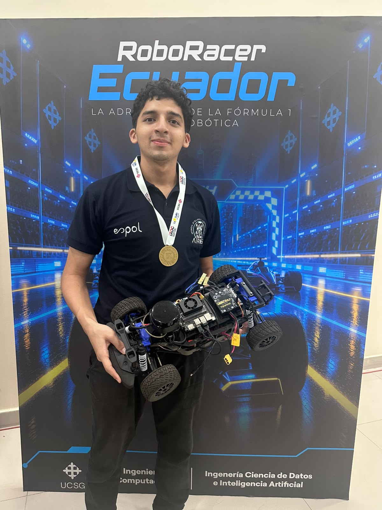
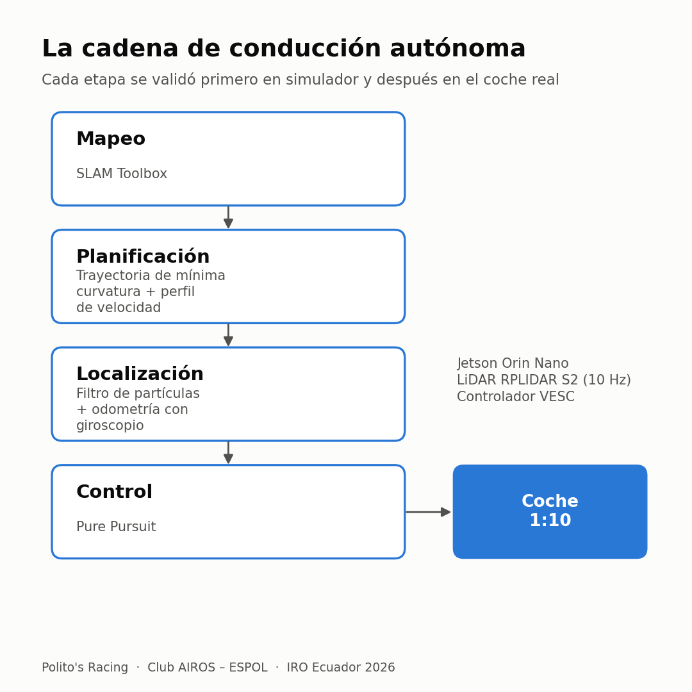
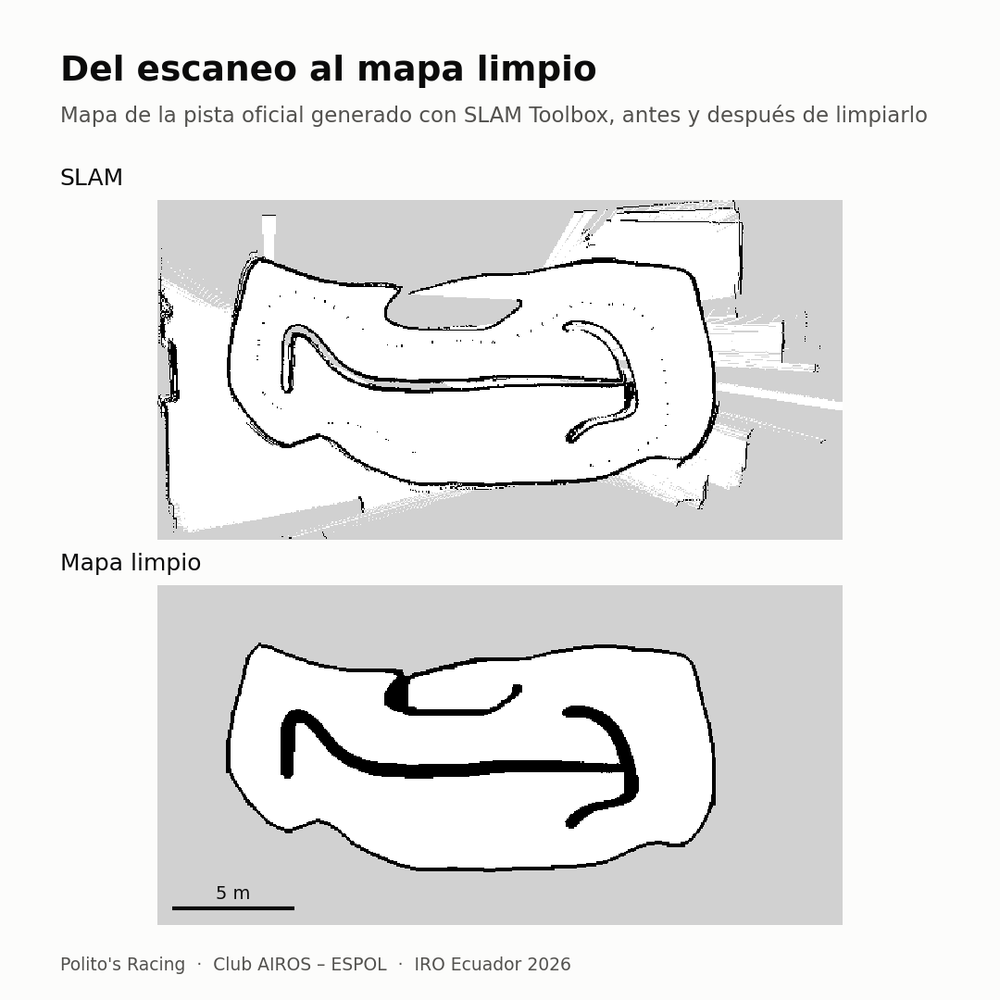
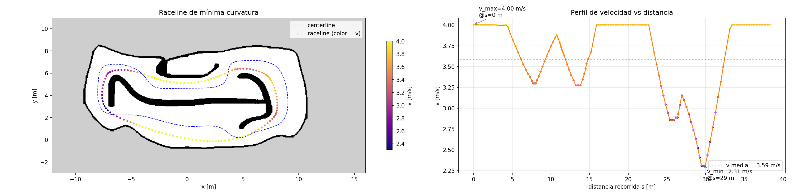
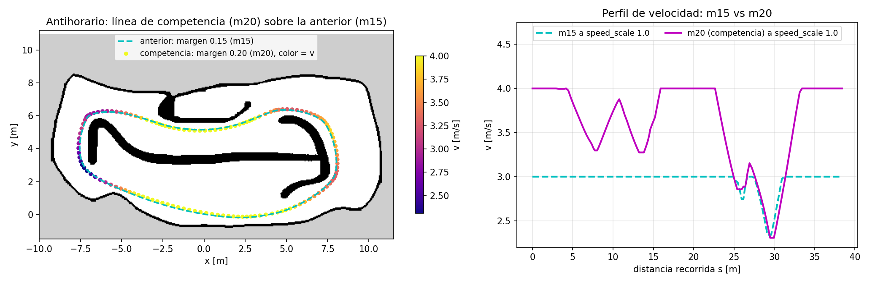
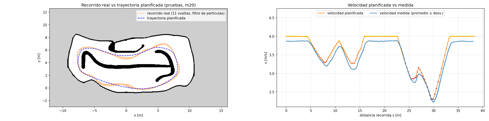

# Polito's Racing · IRO Ecuador 2026 – RoboRacer

**Primer lugar** en el IRO Ecuador 2026 (RoboRacer), con el equipo Polito's Racing del
**Club AIROS – Artificial Intelligence and Robotics Society, ESPOL**.

---

## Resultados

- **Time Trial:** 10 vueltas sin ninguna colisión en cada uno de los 3 intentos.
- **Vuelta más rápida:** 10.23 s (tiempo del equipo).
- **Head to Head Race:** el algoritmo adelanta solo cuando existe una ventana segura.
- **Con un LiDAR de 10 Hz:** 10 lecturas por segundo, a velocidades de hasta ~4.4 m/s en recta.

| | |
|---|---|
|  |  |

**Videos:** [10 vueltas (Time Trial)](media/videos/10_vueltas_time_trial.mp4) · [Prueba de velocidad](media/videos/prueba_de_velocidad.mp4)

---

## La plataforma

Coche autónomo a escala 1:10 tipo [F1TENTH](https://f1tenth.org) / [RoboRacer](https://roboracer.ai):

- Jetson Orin Nano
- LiDAR RPLIDAR S2
- Controlador de motor VESC
- ROS 2 Humble, con el simulador F1TENTH para validar antes de ir al coche real

---

## La cadena de conducción autónoma

1. **Mapeo:** SLAM Toolbox, y limpieza manual del mapa.
2. **Planificación:** trayectoria de mínima curvatura con perfil de velocidad.
3. **Localización:** filtro de partículas con odometría apoyada en giroscopio.
4. **Control:** Pure Pursuit.

---

## Del mapa a la trayectoria

---

## Lo que aprendimos

- Medir el coche real en lugar de suponer sus parámetros.
- Validar cada etapa en el simulador antes de llevarla al coche.
- Guardar los datos de cada prueba para poder analizarlos después.
- Un LiDAR lento se compensa con buena odometría y buena localización.

---

## Si estás empezando

Un orden para aprender, de lo más básico a lo más completo:

1. **ROS 2:** nodos, tópicos y transformadas ([documentación](https://docs.ros.org/en/humble/)).
2. **Teleoperación:** mover el coche con un control y entender los sensores.
3. **SLAM:** hacer un mapa de la pista ([SLAM Toolbox](https://github.com/SteveMacenski/slam_toolbox)).
4. **Localización:** filtro de partículas.
5. **Planificación:** trayectoria de mínima curvatura y perfil de velocidad.
6. **Control:** Pure Pursuit.
7. **Carreras head-to-head:** seguir y adelantar con seguridad.

Se aprende paso a paso.

---

## Créditos

Equipo: Héctor La Mota, Anthony Guadalupe, Raúl Villavicencio,
Micaela Carolina Anamise Llumiquinga y Marcos Emmanuel Balón.

Gracias al Club AIROS y a la ESPOL, a Winter Delgado por sus consejos, y a la Universidad Católica
de Santiago de Guayaquil y al Ph.D. Nabih Pico por organizar este tipo de competencias de
robótica autónoma en Ecuador.
